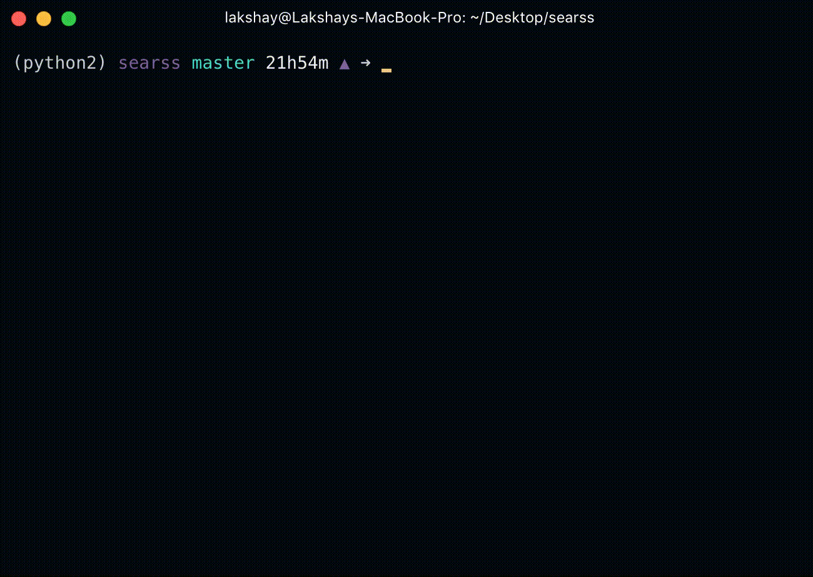

```
 _______  _______  _______  ______    _______  _______
|       ||       ||   _   ||    _ |  |       ||       |
|  _____||    ___||  |_|  ||   | ||  |  _____||  _____|
| |_____ |   |___ |       ||   |_||_ | |_____ | |_____
|_____  ||    ___||       ||    __  ||_____  ||_____  |
 _____| ||   |___ |   _   ||   |  | | _____| | _____| |
|_______||_______||__| |__||___|  |_||_______||_______|

```
[](https://travis-ci.org/fossasia/searss)

### Search To RSS Tool

##### The goal of this mini-tool is to gather search results and store them as RSS feeds on a server.



## Dependencies

* [Python 2.x](https://www.python.org/download/releases/2.7/)
* [Pip](https://pip.pypa.io/en/stable/installing/)
* [Mechanize](http://wwwsearch.sourceforge.net/mechanize/)
* [Feedgen](https://github.com/lkiesow/python-feedgen)
* [BeautifulSoup4](https://www.crummy.com/software/BeautifulSoup/bs4/doc/)
* [Requests](http://docs.python-requests.org/en/master/)

## Installing

1. Clone this repository `git clone https://github.com/fossasia/searss`
2. cd into directory `cd searss`
3. Install requirements using `pip install -r requirements.txt`


## Usage and Options

Run `python rss-generator.py -h` to view the help menu.
```
optional arguments:
  -h, --help            show this help message and exit
  -g, --google              Set search engine as Google
  -b, --bing                Set search engine as Bing
  -ddg, --duckduckgo          Set search engine as DuckDuckGo
  -ask, --askcom          	Set search engine as Ask.com
  -q, --query           Specify search query. eg : --query "xkcd comics"
```

If `rss-generator.py` is run without any arguments, it will prompt you for the search engine and the query.
```
$ python rss-generator.py
$ Select the search engine (0 for google / 1 for duckduckgo / 2 for bing / 3 for ask.com): 0
$ What do you want to search for ? >> xkcd comics

```
### Piping into files
To script the rss generator, pipe a query into `rss-generator.py` and write the result to a file, for example:
`python rss-generator.py --google --query "fossasia" > /tmp/fossasia.rss`
